# 数独控制台程序

NKU 2023 软件工程 结对编程作业; NKU 2023 Software Engineering Assignment

This code is a Sudoku game with the following functionalities: generating Sudoku puzzles, solving Sudoku puzzles, customizing different difficulty levels, generating puzzles with a unique solution, and limiting the scope of blank cells.

- 姓名：管昀玫、石家琪
- 学号：2013750、2011739
- 专业：计算机科学与技术

> 前言：
>
> 在我们的程序中，已实现所有6个要求的功能，包括：
>
> - 生成数独游戏
> - 求解数独游戏
> - 不同难度，保证唯一解，限制挖空范围
>
> 除此之外，我们的程序允许参数乱序，即不固定`-n/-m/-u`或`-n/-r/-u`的相对位置，为参数的输入提供了便利。

项目的GitHub链接为：https://github.com/civilizwa/shudu/tree/master

[toc]

## 代码简略说明

我们的代码主要分为三个部分：

- GenerateHandler: 数独生成
- InputHandler: 输入参数控制
- SolverHandler: 数独求解

### 输入部分

该部分的功能由`InputHandler`类来完成，主要用于输入的参数识别，`check`函数是它的主体。


`check`函数负责识别各个函数，并进行相应的函数调用。


由于逻辑大致相同，此处不再赘述。

### 数独生成部分

主要数独生成算法的思路来源于https://www.jianshu.com/p/4b0d08e19e93


步骤2中首先生成中间的方格，然后按照如下图对应变换行、列获得其它位置的方格，如图可见生成的结果符合数独要求。周围的小方格都可以由中间的方格交换行列变换而来。

步骤3中行列交换是一整行一整列（9个）元素的交换，为了使得交换后的数独仍然是合法的，我们限定交换只发生组内，这样可以证明，交换涉及的行/列和3*3块都仍然是合法的。 非严格证明：经过步骤3交换后生成的数独不重复：

1. 如果是由同一个步骤2中生成的数独变换而成，则显然被交换的行/列分别和原本不一样，又因为只交换两行/列，所以双方对应行/列也相互区别。
2. 如果是由不同步骤2中生成的数独变换而成，显然每次至少有三个（一行/一列）方格不一样，对应的是双方都没有交换的那一组行/列方格。

数独生成部分的函数主要在`GenerateHandler`类中。


重要的函数思路如下所示：

```cpp
bool Generatehandler::generate(int num, int beginNum, int endNum, bool isUnion) {
	/*思路：从beginNum开始挖空，
	如果需要判断union：
	判断不成立后，重新迭代100次，
	超过100次则挖空数+1后重新生成
	直至endNum*/
	fstream infile(absolatePath+FinalPath, ios::in);
	fstream outfile(absolatePath+outputPath, ios::out);
	if (!infile.is_open()) {
		cout << "未找到输入文件的路径!" << endl;
	}
	if (!outfile.is_open()) {
		cout << "文件打开失败!" << endl;
		return false;
	}
	cout << "---------------正在生成" << num << "个数独题目---------------" << endl;
	input(infile); // 将终局读入matrix数组
	infile.close();
	if (isUnion == false) {
		for (int i = 0; i < num; i++) {
			// cout << "generating" << endl;
			current_HoleNum = generateRandomNumber(beginNum, endNum); // 在范围内随机生成挖空个数
			holehole(); // 挖current_HoleNum个洞
			SelectFinal(); // 随机挑选一个终局
			for (int row = 0; row < 9; row++) { // 将终局挖空后的结果输出到文件
				if (holeboard[row][0] == 1) {
					outfile << " $";
				} else {
					outfile << " " << matrix[current_selectFinal][row][0];
				}
				for (int col = 1; col < 9; col++) {
					if (holeboard[row][col] == 1) {
						outfile << " $";
					} else {
						outfile << " " << matrix[current_selectFinal][row][col];
					}
				}
				outfile << endl;
			}
			outfile << endl;
		}
		outfile.close();
		cout << "生成完成!" << endl;
	} else { // 使用回溯法生成唯一解的数独
		vector<std::vector<int>> board;
		for (int t = 0; t < num; t++) { // 在范围内随机生成挖空个数
			// cout << "generating" << endl;
			current_HoleNum = generateRandomNumber(beginNum, endNum);
			generateSudoku(board);
			holehole();
			output(outfile, board);
		}
		outfile.close();
	}
	cout << "生成完成!";
	return true;
}

int Generatehandler::generateRandomNumber(int min, int max) {
	// 设置随机数引擎和分布
	std::random_device rd;
	std::mt19937 gen(rd());
	std::uniform_int_distribution<int> dis(min, max);

	// 生成随机数
	int randomNumber = dis(gen);
	return randomNumber;
}

void Generatehandler::generateSudoku(std::vector<std::vector<int>>& board) {
	std::srand(static_cast<unsigned int>(std::time(0)));  // 设置随机数种子
	// 清空数独游戏
	board.clear();
	board.resize(9, std::vector<int>(9, 0));
	// 随机填充第一行
	for (int col = 0; col < 9; ++col) {
		board[0][col] = col + 1;
	}
	// 混洗第一行的数字
	std::random_shuffle(board[0].begin(), board[0].end());
	// 生成唯一解的数独游戏
	solveSudoku(board);
}

void Generatehandler::holehole() {
	// 置零
	for (int i = 0; i < 9; i++) {
		for (int j = 0; j < 9; j++) {
			holeboard[i][j] = 0;
		}
	}
	// 先挖掉，每行挖两个，再从剩余的空中挖
	for (int i = 0; i < 9; i++) {
		// 设置种子，确保每次运行生成的随机数序列不同
		std::srand(static_cast<unsigned int>(std::time(nullptr)));
		// 生成1到9之间的随机数
		int hole1 = generateRandomNumber(0, 8);
		int hole2 = generateRandomNumber(0, 8);
		while (hole1 == hole2) {
			hole2 = generateRandomNumber(0, 8);
		}
		// 将这两个位置设置为挖去状态
		holeboard[i][hole1] = 1;
		holeboard[i][hole2] = 1;
	}


	int restHole = current_HoleNum - 18;
	while (restHole--) {
		int row = generateRandomNumber(0, 8);
		int col = generateRandomNumber(0, 8);
		while (holeboard[row][col] == 1) {
			row = generateRandomNumber(0, 8);
			col = generateRandomNumber(0, 8);
		}
		holeboard[row][col] = 1;
	}
	return;
}
```

### 数独求解部分

暴力搜索-->剪枝--->启发式搜索

考虑代码的可理解性和可维护性，参考了[这篇博客](https://blog.csdn.net/m0_37590629/article/details/79902552)以及[这篇博客](https://blog.csdn.net/qq_41759198/article/details/89291514)中的回溯和DFS思路，决定采用回溯法求数独。将解空间定义为所有解的空格的所有0-9的所有组合。依次尝试每个空格的1-9的所有取值，看能否生成合法的数独，这样算法的复杂度为$n^9$，n为数独中的空格数目。显然改算式仍然有很大的改进空间，有待后续优化。 

优化：参考上述博客，在填空进入下一层搜索前，先判断是否是合法数独，如果不合法直接跳过，这样可以有效剪枝。但是需要使得判断数独合法算法能够处理数独不完整时的情况。

再进一步的优化为：记录当前行号，尝试数字时快速跳过本行已有的数字；按照数字在空格中出现的比例来顺序尝试，但是需要额外的数据结构和计算比例。

由于时间关系，优化尚未实现，今后可以进一步完善。

`SolveHandler`类定义如下所示：


重要函数如下所示：

```cpp
void SolverHandler::insert(int i, int j, int num) {
    matrix[i][j] = num;
    if (num == '$') {
        blank.push(make_pair(i, j));
    } else {
        row[i] |= (1 << num);
        col[j] |= (1 << num);
        patch[(i / 3) * 3 + j / 3] |= (1 << num);
    }
}

void SolverHandler::remove(int i, int j) {
    int num = matrix[i][j];
    if (num != '$') {
        // matrix[i][j] = (int)'$';
        matrix[i][j] = static_cast<int>('$');
        row[i] ^= (1 << num);
        col[j] ^= (1 << num);
        patch[(i / 3) * 3 + j / 3] ^= (1 << num);
    }
    blank.push(make_pair(i, j));
}

void SolverHandler::replace(int i, int j, int newNum) {
    int oldNum = matrix[i][j];
    if (oldNum == '$') {
        insert(i, j, newNum);
    } else {
        matrix[i][j] = newNum;
        int mask = (1 << oldNum) | (1 << newNum);
        row[i] ^= mask;
        col[j] ^= mask;
        patch[(i / 3) * 3 + j / 3] ^= mask;
    }
}

int SolverHandler::getMask(int i, int j) {
    int mask = 0;
    mask |= row[i];
    mask |= col[j];
    mask |= patch[(i / 3) * 3 + j / 3];
    return mask;
}

void SolverHandler::clean() {
    // 清空数组
    // 清空row、col、patch
    for (int i = 0; i < 9; i++) {
        row[i] = 0;
        col[i] = 0;
        patch[i] = 0;
        for (int j = 0; j < 9; j++) {
            matrix[i][j] = 0;
        }
    }
    // 清空栈
    while (!blank.empty()) {
        blank.pop();
    }
}

int SolverHandler::solve() {
    if (blank.empty()) {
        // No blank positions, success
        return 0;
    }
    pair<int, int> coord = blank.top();
    blank.pop();
    int mask = getMask(coord.first, coord.second);
    for (int i = 1; i <= 9; i++) {
        if ((mask & (1 << i)) == 0) {
            // Not used, search down
            replace(coord.first, coord.second, i);
            int result = solve();
            if (result == 0) {
                return 0;
            }
        }
    }
    // coords pushed back here
    remove(coord.first, coord.second);
    return -1;
}
```

## 用户手册

### 1 程序简介

欢迎使用我们的数独控制台程序！该程序为数独爱好者提供了多项实用功能，包括生成数独终盘、求解数独、批量生成数独游戏以及灵活的游戏定制选项。

通过生成数独终盘功能，您可以获得一个全新的数独谜题的终盘，即完整的已填数字的数独板。这个终盘可以作为一个随机数独游戏的基础，让您在每次游戏时都能体验到不同的挑战和解谜乐趣。

同时，该程序也提供了求解数独的功能。如果您遇到难题或想验证自己的解答是否正确，只需将数独谜题输入程序，它将为您快速求解并给出答案。

除此之外，我们的控制台程序还支持批量生成数独游戏，让您可以一次性获得多个数独谜题。您可以指定生成游戏的难度级别，选择简单、中等或困难的谜题，以适应不同的游戏水平和挑战需求。

定制化选项也是我们程序的亮点之一。您可以指定生成游戏中挖空的数量范围，从较少的空格数到更多的空格数，根据自己的喜好和难度偏好定制游戏体验。此外，您还可以选择生成游戏时的解唯一要求，确保每个数独谜题都有唯一的解决方案。

我们希望通过使用我们的数独控制台程序，您可以尽情享受数独的乐趣，锻炼逻辑思维和推理能力。如果您有任何问题或需要支持，请随时与我们联系。祝您玩得愉快并挑战成功！

### 2 安装与运行

1. 下载程序：请前往我们的[GitHub](https://github.com/civilizwa/shudu/tree/master)，获取数独控制台程序的exe文件。
2. 解压文件：将下载的安装文件解压到您希望安装程序的目录。
3. 打开控制台：打开操作系统的命令提示符（Windows系统为命令提示符，Linux和macOS系统为终端）。
4. 切换目录：使用命令提示符（或终端）中的`cd`命令，切换到数独控制台程序的exe所在目录。默认情况下，目录为：`shudu\x64\Release`
5. 运行程序：在命令提示符（或终端）中输入程序的可执行文件名称，并指定参数信息，按下回车键运行程序。
6. 指定文件位置参数：在运行程序时，使用命令行参数指定数独谜题文件的位置。根据程序的要求，可能需要输入文件的完整路径或相对路径。请根据程序的使用说明提供正确的文件位置参数。

如果您在安装和运行过程中遇到任何问题，请参阅程序的用户手册或联系我们的支持团队获取帮助。

祝您愉快地安装和运行数独控制台程序，并享受解谜的乐趣！

### 3 界面介绍

我们的数独控制台程序提供了简洁而直观的界面，使您能够轻松操作和享受数独游戏的乐趣。

1. 命令输入：命令输入是数独游戏中最重要的部分，具体参数详见后文介绍。通过命令输入，可以指定需要的数独终盘数量、需要解的数独棋盘文件路径、需要的游戏数量、生成的游戏难度、生成游戏的难度、唯一解等。
2. 提示信息：程序通常会在界面中显示一些操作提示，指导您如何与数独进行交互，如提示输入路径、输入错误警告、开始生成若干数独终盘等。请仔细阅读和遵循这些提示，以正确地操作数独游戏。
4. 结果显示：在求解数独或执行其他操作后，程序会在界面中显示相应的结果。这可能是数独的解答、生成的数独游戏、操作的成功或失败消息等。请注意仔细阅读结果显示，以获取所需的信息。

### 4 使用指南

在`shudu.exe`目录下打开命令行窗口，输入如下格式的命令：

`````c++
shudu.exe [parameters]
`````

注意，每一次运行，都要填入txt文件所在或生成的绝对路径，下面给出示例：

#### 4.1 生成数独终盘

使用参数`-c`，并指定数目，即可生成数独终盘

| [para]  | -c                                   |
| :------ | :----------------------------------- |
| mean    | 需要生成的数组终盘数量               |
| range   | 1-1000000                            |
| example | shudu.exe -c 20 【生成20个数独终盘】 |


#### 4.2 读取游戏并给出解答

使用参数`-s`，读取若干数独游戏并给出解答

| [para]     | -s                                                           |
| :--------- | :----------------------------------------------------------- |
| mean       | 需要解的数组棋盘文件路径                                     |
| limitation | 绝对或者相对路径                                             |
| example    | shudu.exe -s game.txt 【从game.txt读取若干个数独游戏，并给出解答，生成到sudoku.txt中】 |

`question.txt`示例：使用`$`符号代表待填的空


命令程序进行求解：

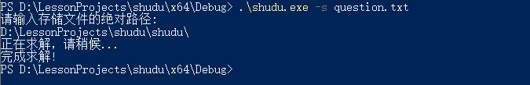

求解完成后，该目录下出现`ans.txt`：


`ans.txt`内容为求解完成的数独解答：


#### 4.3 批量生成数独游戏

使用参数`-n`，并指定需要的游戏数量，即可批量生成数独

| [para]  | -n                                       |
| :------ | :--------------------------------------- |
| mean    | 需要的游戏数量                           |
| range   | 1-10000                                  |
| example | shudu.exe -n 1000 【生成1000个数组游戏】 |


生成的`question.txt`如下所示，以`$`来代替待填的数字：

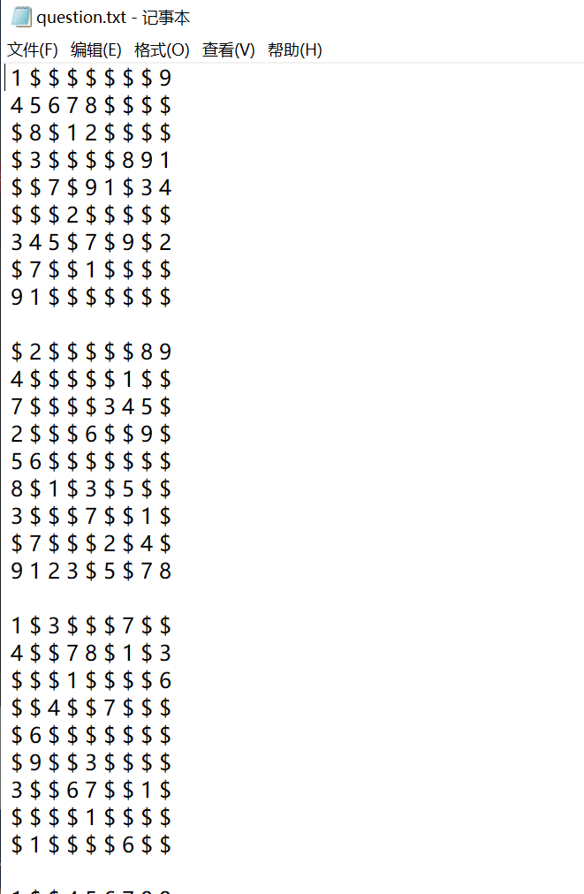

#### 4.4 生成游戏的难度

使用参数`-n`和`-m`，需要指定生成游戏的数量和难度，难度为数字1~3之间，数字越大代表越难

| [para]  | -m                                                           |
| :------ | :----------------------------------------------------------- |
| mean    | 生成游戏的难度                                               |
| range   | 1-3                                                          |
| example | shudu.exe -n 1000 -m 1 【生成1000个简单数独游戏，只有m和n一起使时才认为参数无误，否则请报错】 |

尝试生成难度1：


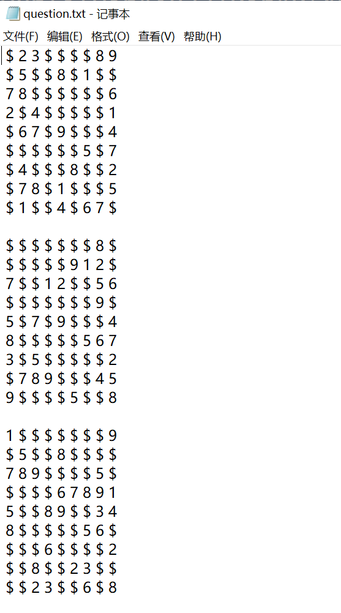

尝试生成难度2：


尝试生成难度3：


> 求解后的难度3为：
>
> 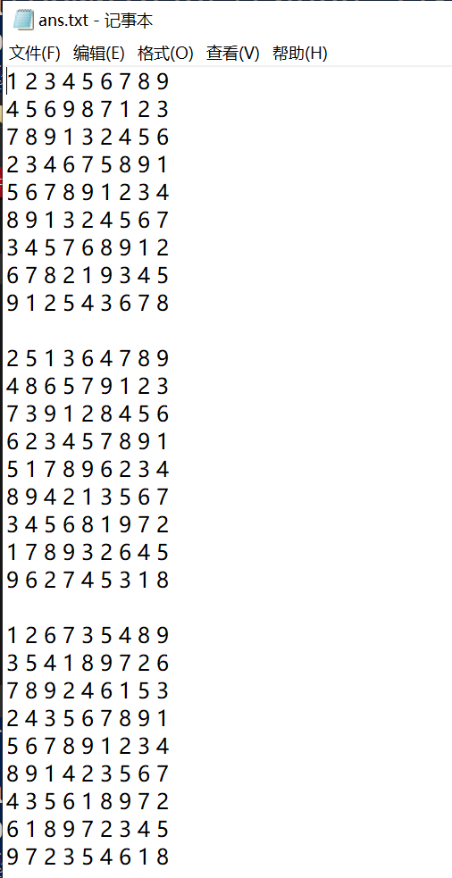

#### 4.5 控制挖空数量范围

同时使用参数`-n`和`-r`，指定生成数独游戏的数量和挖空范围。注意，挖空范围的两个数应用`-`符号链接。

| [para]  | -r                                                           |
| :------ | :----------------------------------------------------------- |
| mean    | 生成游戏中挖空的数量范围                                     |
| range   | 20-55                                                        |
| example | shudu.exe -n 20 -r 20-55 【生成20个挖空数在20~55之间的数独游戏，只有r和n一起使用才认为参数无误，否则请报错】 |


#### 4.6 生成唯一解游戏

同时使用参数`-n`与`-u`，即可指定生成游戏的数量，且它们具有唯一解

| [para]  | -u                                                           |
| :------ | :----------------------------------------------------------- |
| mean    | 生成游戏的解唯一                                             |
| example | shudu.exe -n 20 -u 【生成20个解唯一的数独游戏，只有u和n一起使用才认为参数无误，否则请报错】 |


成功生成了`question.txt`：


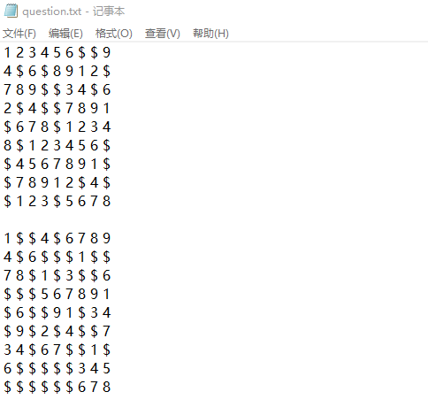

#### 4.7 参数乱序与多个参数

在我们的程序中，参数的位置可以并不固定，且允许三个参数结合使用，例如：

- `\shudu.exe -r 20-30 -u -n 20`
- `\shudu.exe -n 20 -m 1 -u`


### 4.8 错误与恢复

当错误输入参数时，程序会提示相应的错误，如下所示：


此时只需要根据提示重新进行输入即可。


### 5 保存与加载

数独生成与求解的各种文件名解释如下：

- `final.txt`：默认终局文件
- `question.txt`：默认题目存储文件
- `ans.txt`：默认求解结果文件

建议用户使用一个固定目录来存储与管理这些文件，以免发生混乱。

## 质量分析

我们使用微软的CppCoreCheck进行代码质量分析。

### 1 消除警告

我们首先分析警告：

1. 算数溢出

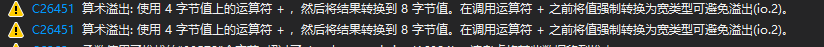

原代码为：


该警告指的是在计算 `startRow + i` 和 `startCol + j` 时，可能会发生整数溢出。这可能是因为编译器把 `startRow + i` 和` startCol + j` 这两个表达式的结果从 `int `（4字节）转换为` size_t` （在64位系统上是8字节）的过程中发生的。然而，由于` startRow`, `startCol`, `i`, 和`j `的值都在 0 到 9 之间，所以这里实际上不可能发生溢出。

但是为了消除，我们应该在做加法运算之前，就先把操作数转换为 `size_t`。这样可以确保加法运算的结果不会超过 `size_t` 可以表示的范围。

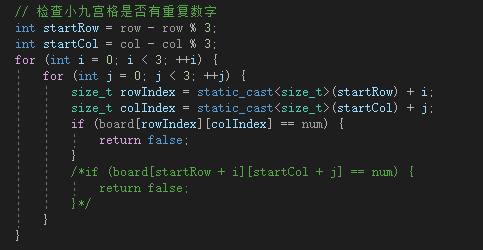

而另一处算数溢出是发生在打印进度条时：

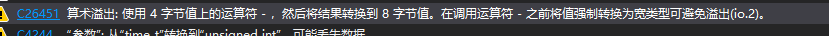

源代码为


同理，我们使用`static_cast<size_t>`即可消除警告。


2. `time_T`转换到`unsigned int`，可能丢失数据

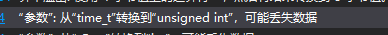

该问题的原代码为：


这个警告是由于将 `time_t` 类型的值转换为 `unsigned int` 类型时可能会丢失数据导致的。同样，我们可以使用`static_cast` 进行显式的类型转换。

修改代码为：


即可消除警告。

3. `_Rep`转换到`int`，可能丢失数据


发生警告的代码为：


本质上也是数据类型转换的问题，使用`static_cast`解决该问题。修改代码如下：

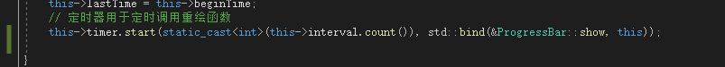

即可消除警告。

另一处同类型的警告的代码为：

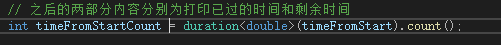

修改为：

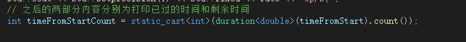

4. `double`转换到`int`，可能丢失数据


发生警告的代码为：

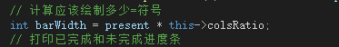

对于将 `double` 转换为 `int`，使用 `static_cast<int>` 来消除警告。

修改代码为：

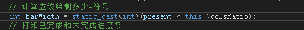

另一处同类型的数据转换问题的警告为：

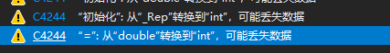

发生警告的代码为：


同样使用`static_cast`即可消除警告。


至此，所有警告已全部消除。


### 2 静态代码分析

使用VS2019中的Code Analysis进行分析，分析结果如下所示：

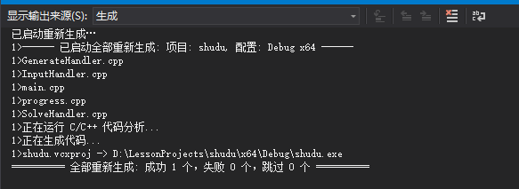

成功运行，没有警告。

### 3 代码规范检查

这里遵循的是谷歌的C++编程规范，链接为：https://zh-google-styleguide.readthedocs.io/en/latest/google-cpp-styleguide/contents/，大致规范为：


图源https://blog.csdn.net/zyy617532750/article/details/81264648

我们使用的代码规范检查工具为cpplint。

1. **GenerateHandler.cpp**

修改前：

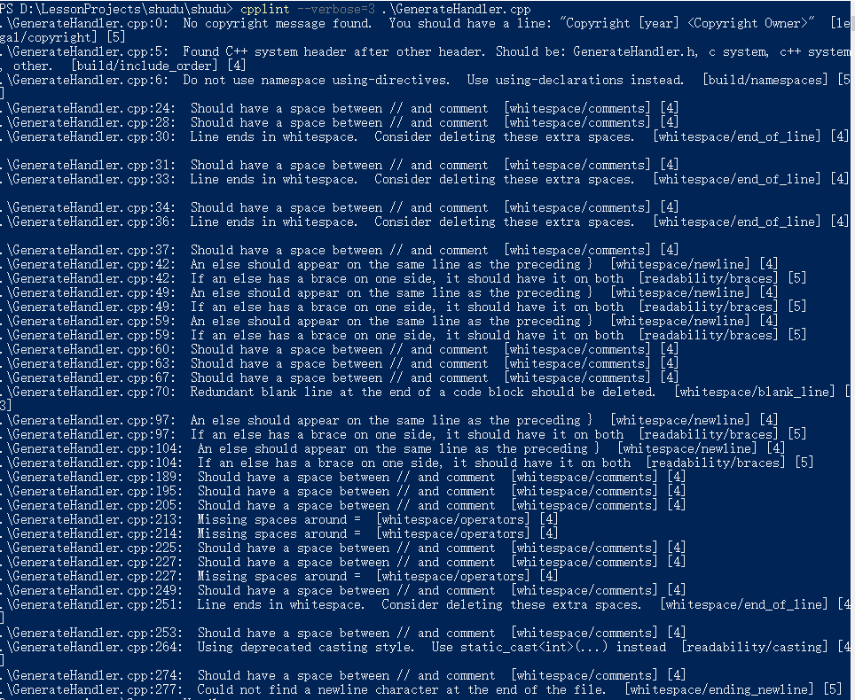

总结错误如下：

1. 没有版权信息：应该在文件中添加版权信息行，例如："Copyright [year] <Copyright Owner>"。[legal/copyright]
2. 头文件包含顺序问题：C++系统头文件应该放在其他头文件之前，正确顺序应为：GenerateHandler.h、C系统头文件、C++系统头文件、其他头文件。[build/include_order]
3. 命名空间错误：不要使用命名空间的using-directives，应使用using-declarations。[build/namespaces]
4. 空格与注释问题：应在注释符 "//" 和注释之间添加空格，删除行末多余的空格，确保代码的一致性和可读性。[whitespace/comments] [whitespace/end_of_line]
5. 大括号和else语句问题：else语句应与前面的 "}" 在同一行上，如果有大括号，应该在两边都使用。这样可以提高代码的可读性。[whitespace/newline] [readability/braces]
6. 多余的空白行问题：应删除代码块末尾多余的空白行。[whitespace/blank_line]
7. 等号周围的空格问题：等号周围应该添加空格，提高代码的可读性。[whitespace/operators]
8. 强制类型转换问题：使用过时的C风格强制类型转换，建议使用`static_cast<int>(...)`进行类型转换。[readability/casting]
9. 文件末尾缺少换行符：文件末尾应包含一个换行符。[whitespace/ending_newline]

根据提示，我们逐行对代码进行修改，修改之后无error，如下图所示：


2. **GenerateHandler.h**

对于`GenerateHandler.h`，cpplint提示信息如下：

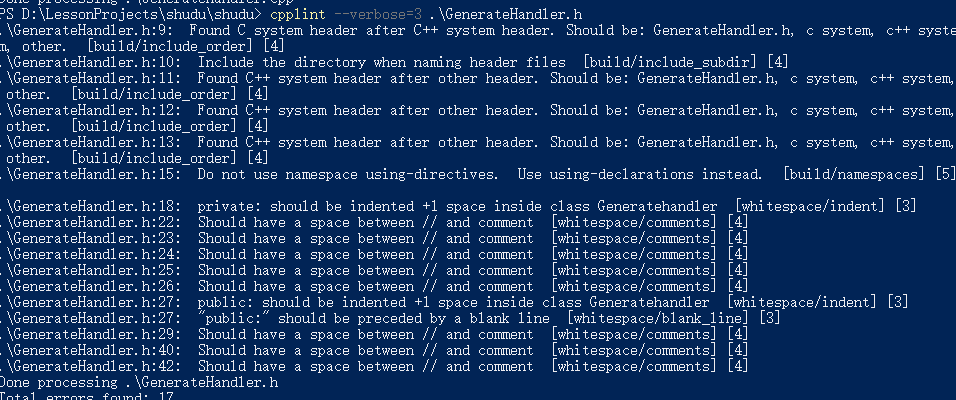

以上errors总结为：

1. 头文件包含顺序问题：C系统头文件应该在C++系统头文件之前。[build/include_order]
2. 头文件命名问题：在命名头文件时，应包含目录信息。[build/include_subdir]
3. 命名空间错误：不要使用命名空间的using-directives，应使用using-declarations。[build/namespaces]
4. 类中的private部分缩进问题：在GenerateHandler类中的private部分应该缩进一个空格。[whitespace/indent]
5. 注释与斜线问题：注释符 "//" 和注释之间应添加一个空格。[whitespace/comments]
6. 类中的public部分缩进问题：在GenerateHandler类中的public部分应该缩进一个空格。[whitespace/indent]
7. 类中的public部分前的空白行问题：在GenerateHandler类中的public部分前应有一个空白行。[whitespace/blank_line]

逐一解决以上问题，最终完全解决所有报错：


3. **InputHandler.cpp**


以上报错大致与前两个文件报错内容相同，逐一解决即可：


4. **InputHandler.h**


常规错误，解决即可：


5. **main.cpp**


消除以上错误：


6. **progree.cpp**


7. **progress.h**


8. **SolveHandler.cpp**

大部分错误我们之前已经遇到过，逐行修改即可：


9. **SolveHandler.h**


## 单元测试

使用Visual Studio自带的测试项目模板，关联Sudoku项目进行测试。需要创建一个新项目，使用本机单元测试项目模板，然后添加现有项，关联`main.obj`即可。

###  1 定义输入

首先我们定义一连串的字符串，以模拟正常可能的输入。正常输入如下所示：


```cpp
	int argc1, argc2, argc3, argc4;
	char** argv1, ** argv2, ** argv3, ** argv4, ** argv5, ** argv6, ** argv7;
	string path = "D:\\LessonProjects\\shudu\\";

	argc1 = 3;
	argc2 = 4;
	argc3 = 5;
	argc4 = 6;
	argv1 = new char* [3];//c
	argv2 = new char* [3];//s
	argv3 = new char* [3];//n
	argv4 = new char* [4];//n u
	argv5 = new char* [5];//n m
	argv6 = new char* [5];//n r
	argv7 = new char* [6];//n r u

	for (int i = 0; i < 3; i++) {
		argv1[i] = new char[30];
		argv2[i] = new char[30];
		argv3[i] = new char[30];
	}
	for (int i = 0; i < 4; i++) {
		argv4[i] = new char[30];

	}
	for (int i = 0; i < 5; i++) {
		argv5[i] = new char[30];
		argv6[i] = new char[30];
	}
	for (int i = 0; i < 6; i++) {
		argv7[i] = new char[30];
	}

	strcpy_s(argv1[0], 30, "shudu.exe");
	strcpy_s(argv1[1], 30, "-c");
	strcpy_s(argv1[2], 30, "100");

	strcpy_s(argv2[0], 30, "shudu.exe");
	strcpy_s(argv2[1], 30, "-s");
	strcpy_s(argv2[2], 30, "question.txt");

	strcpy_s(argv3[0], 30, "shudu.exe");
	strcpy_s(argv3[1], 30, "-n");
	strcpy_s(argv3[2], 30, "100");

	strcpy_s(argv4[0], 30, "shudu.exe");
	strcpy_s(argv4[1], 30, "-n");
	strcpy_s(argv4[2], 30, "10");
	strcpy_s(argv4[3], 30, "-u");

	strcpy_s(argv5[0], 30, "shudu.exe");
	strcpy_s(argv5[1], 30, "-n");
	strcpy_s(argv5[2], 30, "100");
	strcpy_s(argv5[3], 30, "-m");
	strcpy_s(argv5[4], 30, "3");

	strcpy_s(argv6[0], 30, "shudu.exe");
	strcpy_s(argv6[1], 30, "-n");
	strcpy_s(argv6[2], 30, "100");
	strcpy_s(argv6[3], 30, "-r");
	strcpy_s(argv6[4], 30, "20-55");

	strcpy_s(argv7[0], 30, "shudu.exe");
	strcpy_s(argv7[1], 30, "-n");
	strcpy_s(argv7[2], 30, "100");
	strcpy_s(argv7[3], 30, "-r");
	strcpy_s(argv7[4], 30, "20-55");
	strcpy_s(argv7[3], 30, "-u");
```

之后便可以开始各个部分的测试。

### 2 测试用例设计

1. 当参数为`-c`时，默认的数量为100，即生成100个游戏终盘。

   我们使用`InputHandler`的`GetNum`和`GetType`函数来测试`setAbsPath`和`check`函数是否正常。使用`setAbsPath`设置路径，并使用`check`函数将参数传入。首先验证是否正确接收到数量100这个数字，其次验证是否正确接收到参数为`-c`。如果都正确接收，函数会返回`true`，失败将显示错误信息，并返回`false`。

   ```cpp
   //测试InputHandler,参数为-c时
   		TEST_METHOD(TestMethod1)
   		{
   			InputHandler inputs;
   			inputs.setAbsPath(path);
   			inputs.check(argc1, argv1);
   			Assert::AreEqual(inputs.GetNum() == 100, true);
   			Assert::AreEqual(inputs.GetType1() == 'c', true);
   		}
   ```

2. 当参数为`-s`时，求解游戏。

   仍然使用`InputHandler`的`GetNum`和`GetType`函数进行测试，期望正确识别参数`-s`和文件路径。

   ```cpp
   //测试InputHandler, 参数为-s时
   		TEST_METHOD(TestMethod2)
   		{
   			InputHandler inputs;
   			inputs.setAbsPath(path);
   			inputs.check(argc1, argv2);
   			Assert::AreEqual(inputs.GetType1() == 's', true);
   		}
   ```

3. 当参数为`-n`时，生成数独游戏

   此时我们需要使用`inputs.generator`的`generate`函数来生成数独游戏。如果生成成功，将会返回`true`。且能正常识别参数`-n`。

   ```cpp
   TEST_METHOD(TestMethod3)
   		{
   			InputHandler inputs;
   			inputs.setAbsPath(path);
   			inputs.check(argc1, argv3);
   			bool abc = inputs.generator.generate(100, 18, 64, false);
   			Assert::AreEqual(inputs.GetType1() == 'n', true);
   			Assert::AreEqual(abc, true);
   		}
   ```

4. 命令行参数只有两个

   正常来说，命令行的参数至少为3个。若只传入两个参数，那么程序本身会输出错误提示，且参数类型被初始化后不能被修改，即一直为初始化的`y`。

   ```cpp
   //测试InputHandler，命令行参数不是2个
   		TEST_METHOD(TestMethod4)
   		{
   			argc1 = 2;
   			InputHandler inputs;
   			inputs.setAbsPath(path);
   			inputs.check(argc1, argv1);
   			Assert::AreEqual(inputs.GetType1() == 'y', true);
   		}
   ```

5. 参数不在给定范围中

   假设参数不是给定的6个可使用参数中的任何一个，为`x`，则参数的type不能被正确地赋值，和第四个相同：
   
   ```cpp
   //测试InputHandler，参数不是-c\-s\-n
   		TEST_METHOD(TestMethod5)
   		{
   			argv1[1][1] = 'x';
   			InputHandler inputs;
   			inputs.setAbsPath(path);
   			inputs.check(argc1, argv1);
   			Assert::AreEqual(inputs.GetType1() == 'y', true);
   		}
   ```
   
6. 测试生成数量

   ```cpp
   TEST_METHOD(TestMethod6)
   		{
   			argv1[2][0] = '-';
   			argv1[2][1] = '1';
   			InputHandler inputs;
   			inputs.setAbsPath(path);
   			inputs.check(argc1, argv1);
   			Assert::AreEqual(inputs.GetNum() == 1, true);
   		}
   ```

7. 测试能否生成数独终局

   调用generate函数，以生成数独终局。如果成功生成，则会返回`true`，失败将显示错误信息，并返回`false`。

   ```cpp
   //测试生成数独终局
   		TEST_METHOD(TestMethod7)
   		{
   			strcpy_s(argv1[2], 30, "1");
   			InputHandler inputs;
   			inputs.setAbsPath(path);
   			inputs.check(argc1, argv1);
   			bool a = inputs.generator.generate(inputs.GetNum(), 18, 64, false);
   			Assert::AreEqual(true, a);
   		}
   ```

8. 测试生成唯一解

   同上，需要调用generate函数。但是这里需要在`generate`函数中传入`true`，表明生成具有唯一解的游戏，成功生成将返回`true`，失败将显示错误信息，并返回`false`。

   ```cpp
   //测试生成唯一解
   		TEST_METHOD(TestMethod8)
   		{
   			InputHandler inputs;
   			inputs.setAbsPath(path);
   			inputs.check(argc2, argv4);
   			Assert::AreEqual(inputs.GetNum() == 10, true);
   			Assert::AreEqual(inputs.GetType1() == 'n', true);
   			Assert::AreEqual(inputs.GetType2() == 'u', true);
   			bool a = inputs.generator.generate(inputs.GetNum(),s 18, 64, true);
   			Assert::AreEqual(true, a);
   		}
   ```

9. 测试指定level

   同样，测试`-n`和`-m`参数能否被正确识别，数字是否被正确赋值。当参数`-m`为3时，挖空数量为`33~64`，成功创建游戏将返回`true`，失败将显示错误信息，并返回`false`。

   ```cpp
   //测试指定level
   		TEST_METHOD(TestMethod9)
   		{
   			InputHandler inputs;
   			inputs.setAbsPath(path);
   			inputs.check(argc3, argv5);
   			Assert::AreEqual(inputs.GetNum() == 100, true);
   			Assert::AreEqual(inputs.GetType1() == 'n', true);
   			Assert::AreEqual(inputs.GetType2() == 'm', true);
   			Assert::AreEqual(inputs.GetLevel() == 3, true);
   			bool a = inputs.generator.generate(inputs.GetNum(), 33, 64, true);
   			Assert::AreEqual(true, a);
   		}
   ```

10. 测试指定挖空数量

    同样调用generate函数，但是挖空范围由`GetRange`获取，成功生成游戏将返回`true`，失败将显示错误信息，并返回`false`。

    ```cpp
    //测试指定挖空数量
    		TEST_METHOD(TestMethod10)
    		{
    			InputHandler inputs;
    			inputs.setAbsPath(path);
    			inputs.check(argc3, argv6);
    			Assert::AreEqual(inputs.GetNum() == 100, true);
    			Assert::AreEqual(inputs.GetType1() == 'n', true);
    			Assert::AreEqual(inputs.GetType2() == 'r', true);
    			Assert::AreEqual(inputs.GetRange1() == 20, true);
    			Assert::AreEqual(inputs.GetRange2() == 30, true);
    			bool a = inputs.generator.generate(inputs.GetNum(), inputs.GetRange1(), inputs.GetRange2(), true);
    			Assert::AreEqual(true, a);
    		}
    ```

11. 测试该数独可以解

    测试`solveSudoku`函数，确保对于一个给定的数独游戏，它能否正确地找到解。

    ```cpp
    //测试该数独可以解
    		TEST_METHOD(TestMethod11)
    		{
    			Generatehandler handler;
    			vector<vector<int>> board = {
    				{5, 3, '$', '$', 7, '$', '$', '$', '$'},
    				{6, '$', '$', 1, 9, 5, '$', '$', '$'},
    				{'$', 9, 8, '$', '$', '$', '$', 6, '$'},
    				{8, '$', '$', '$', 6, '$', '$', '$', 3},
    				{4, '$', '$', 8, '$', 3, '$', '$', 1},
    				{7, '$', '$', '$', 2, '$', '$', '$', 6},
    				{'$', 6, '$', '$', '$', '$', 2, 8, '$'},
    				{'$', '$', '$', 4, 1, 9, '$', '$', 5},
    				{'$', '$', '$', '$', 8, '$', '$', 7, 9}
    			};
    			Assert::AreEqual(handler.solveSudoku(board), true); // 该数独游戏可以解
    		}
    ```

12. 确保生成9*9游戏且有解

    测试`generateSudoku`函数，确保它能生成一个9x9的数独游戏，并且这个游戏有解。

    ```cpp
    TEST_METHOD(TestMethod12)
    		{
    			Generatehandler handler;
    			vector<vector<int>> board;
    			handler.generateSudoku(board);
    
    			// 检查是否生成的是9x9的数独游戏
    			size_t nine = 9;
    			Assert::AreEqual(board.size(), nine);
    			for (const auto& row : board) {
    				Assert::AreEqual(row.size(), nine);
    			}
    
    			// 检查是否有解
    			Assert::AreEqual(handler.solveSudoku(board), true);
    		}
    ```

13. 测试能否放置数字

    测试`isValid`函数，确保在给定的行、列和数字情况下，能否正确地验证是否可以放置这个数字。

    ```cpp
    //测试能否放置数字
    		TEST_METHOD(TestMethod13)
    		{
    			Generatehandler handler;
    			vector<vector<int>> board = {
    				{5, 3, '$', '$', 7, '$', '$', '$', '$'},
    				{6, '$', '$', 1, 9, 5, '$', '$', '$'},
    				{'$', 9, 8, '$', '$', '$', '$', 6, '$'},
    				{8, '$', '$', '$', 6, '$', '$', '$', 3},
    				{4, '$', '$', 8, '$', 3, '$', '$', 1},
    				{7, '$', '$', '$', 2, '$', '$', '$', 6},
    				{'$', 6, '$', '$', '$', '$', 2, 8, '$'},
    				{'$', '$', '$', 4, 1, 9, '$', '$', 5},
    				{'$', '$', '$', '$', 8, '$', '$', 7, 9}
    			};
    
    			Assert::AreEqual(handler.isValid(board, 0, 2, 1), true); // 5x5位置可以放1
    			Assert::AreEqual(handler.isValid(board, 0, 0, 6), false); // 5x5位置不能放6
    		}
    ```

14. 6个参数

    当输入的参数为：`-n 100 -r 20-55 -u`时

    ```cpp
    TEST_METHOD(TestMethod14)
    		{
    			InputHandler inputs;
    			inputs.setAbsPath(path);
    			inputs.check(argc4, argv7);
    			Assert::AreEqual(inputs.GetNum() == 100, true);
    			Assert::AreEqual(inputs.GetType1() == 'n', true);
    			Assert::AreEqual(inputs.GetType2() == 'r', true);
    			Assert::AreEqual(inputs.GetType3() == 'u', true);
    			assert(inputs.GetRange1() == 20, true);
    			assert(inputs.GetRange2() == 55, true);
    			bool a = inputs.generator.generate(inputs.GetNum(), inputs.GetType1(), inputs.GetType2(), true);
    			Assert::AreEqual(true, a);
    
    		}
    ```

15. 参数乱序

    当输入的参数为：`-u  -n 100 -m 1`时

    ```
    TEST_METHOD(TestMethod16)
    		{
    			strcpy_s(argv7[0], 30, "shudu.exe");
    			strcpy_s(argv7[1], 30, "-n");
    			strcpy_s(argv7[2], 30, "100");
    			strcpy_s(argv7[3], 30, "-r");
    			strcpy_s(argv7[4], 30, "20-55");
    			strcpy_s(argv7[3], 30, "-u");
    			InputHandler inputs;
    			inputs.setAbsPath(path);
    			bool abc = inputs.generator.generate(1, 20, 30, false);
    			Assert::AreEqual(abc, true);
    		}
    ```

单元测试全部通过：


除此之外，我们还通过命令行对代码进行了测试，以下是各种情况的执行情况：

| 编号 | 命令行参数           | 结果                                                         |
| ---- | -------------------- | ------------------------------------------------------------ |
| 1    | -c 1                 | 已生成1个游戏终盘                                            |
| 2    | -c 100               | 已生成100个游戏终盘                                          |
| 3    | -c 1000000           | 已生成1000000个游戏终盘                                      |
| 4    | -c 1000001           | 不满足0<n<=1000000!                                          |
| 5    | -c 0                 | 不满足0<n<=1000000!                                          |
| 6    | -cc 12               | 输入有误!                                                    |
| 7    | -c x                 | 不满足0<n<=1000000!                                          |
| 8    | -s question.txt      | 完成求解!                                                    |
| 9    | -s illegalsudoku.txt | 第`i`个数独无解                                              |
| 10   | -s unexistfile.txt   | 文件打开失败!                                                |
| 11   | -n 100               | 生成成功!                                                    |
| 12   | -n 0                 | 不满足0<n<=1000000!                                          |
| 13   | -n 1001              | 不满足0<n<=1000000!                                          |
| 14   | -x                   | 输入错误，请重新输入!                                        |
| 15   | -n 100 -u            | 生成成功                                                     |
| 16   | -n 100 -m            | 输入参数为三个，但不存在-u选项！                             |
| 17   | -n 10000001 -u       | 生成数独题库数量不规范(0<n<1000000)!请重新输入生成数         |
| 18   | -n 100 -r 20-55      | 生成成功                                                     |
| 19   | -n 100 -r 4          | [-r]项参数不规范，应输入a-b形式的参数，请重新输入!           |
| 20   | -n 100 -r 20-e       | [-r]项参数不规范，应输入a-b形式的正整数，请重新输入!         |
| 21   | -n 100 -m 1          | 生成成功                                                     |
| 22   | -n 100 -m 6          | 输入的难度不符合规范，应为1-3之间的整数!                     |
| 23   | -n 100 -x 6          | 输入有误!存在未定义的选项                                    |
| 24   | -n 100 -m 1 -u       | 生成成功                                                     |
| 25   | -n 100 -m 1 -x       | 输入命令行格式错误，出现单数个参数但未出现[-u]，请重新输入!  |
| 26   | -n 100 -r 10-15 -u   | 存在-r项不规范问题：可能原因1.范围设置有误2.该范围无法生成唯一解(请将范围设置在18-64) |
| 27   | -n 100 -r 22 -u      | [-r]项参数不规范，应输入a-b形式的参数，请重新输入!           |
| 28   | -m 1 -n 100 -u       | 生成成功                                                     |
| 29   | -r 20-55 -u -n 100   | 生成成功                                                     |

| 生成个数      | 预期输出 | 实际输出 |
| ------------- | -------- | -------- |
| 1             | 1        | 1        |
| 20            | 20       | 20       |
| 100           | 100      | 100      |
| 1000          | 1000     | 1000     |
| 1000000       | 1000000  | 1000000  |
| 数独求解 编号 | 预期输出 | 实际输出 |
| 1             | 正确     | 正确     |
| 2             | 正确     | 正确     |
| 3             | 正确     | 正确     |
| 4             | 正确     | 正确     |
| 5             | 正确     | 正确     |

经检查，数独生成可解，生成求解正确，代码逻辑无误。

## 覆盖率报告

在VS2019中使用OpenCppCoverage进行分析，使用的指令为：

- `shudu.exe -c 100`
- `shudu.exe -s question.txt`
- `shudu.exe -n 100`
- `shudu.exe -n 100 -u`
- `shudu.exe -u -n 100`
- `shudu.exe -n 100 -m 3`
- `shudu.exe -n 100 -m 2`
- `shudu.exe -n 100 -m 1`
- `shudu.exe -n 100 -m -6`
- `shudu.exe -n 0 -m 2`
- `shudu.exe -n 100 -r 20-55`
- `shudu.exe -n 0`
- `shudu.exe -r dd`
- `shudu.exe -n 100 -r 20-55 -u`
- `shudu.exe -n 100 -r 1-6 -u`
- `shudu.exe -n 100 -r 1 -u`
- `shudu.exe -u -r 20-55 -n 10`
- `shudu.exe -u -r 0-5 -n 10`
- `shudu.exe -u  -r 11 -n 10`
- `shudu.exe -u -m 1 -n 10`
- `shudu.exe -u -m 2 -n 10`
- `shudu.exe -u -m 3 -n 10`
- `shudu. exe -u -m 6 -n 10`
- `shudu.exe -m 1 -u -n 10`
- `shudu.exe -m -u 1 -n 10`

分析结果如下所示：


可以看到，这些指令几乎已经覆盖了所有的代码，只有少数else循环表示错误的语句没有进入，整体覆盖率达到90%，表明代码的测试质量较高。

## 性能分析

### 1 性能探查器

我们VS2019的性能探查器来进行分析。


可以看到，总体来说，`std::mersenne_twister<unsigned int ....>::_Refill_upper`这个函数是耗时最多的函数。

> `std::mersenne_twister<unsigned int ...>::_Refill_upper` 函数是 C++ 标准库中的 `std::mersenne_twister` 类模板的私有成员函数之一。这个函数主要用于内部生成随机数序列。
>
> `std::mersenne_twister` 是一个伪随机数生成器，它基于梅森旋转算法（Mersenne Twister Algorithm），被广泛用于生成高质量的随机数序列。该算法的实现分为几个关键步骤，其中 `_Refill_upper` 函数在其中扮演了重要的角色。
>
> 具体而言，`_Refill_upper` 函数的功能是填充 Mersenne Twister 算法的内部状态数组（state array）中的上半部分（即高位部分）。Mersenne Twister 算法使用一个很长的状态数组作为内部状态，在生成每个随机数时，需要对这个数组进行更新和变换。`_Refill_upper` 函数负责更新数组中的上半部分，以确保生成的随机数具有良好的统计特性和周期性。
>
> 由于 `_Refill_upper` 函数是私有成员函数，意味着它只能在类内部使用，而无法直接从外部调用。它在 Mersenne Twister 算法的内部执行，并在需要时自动被调用，以满足随机数的生成需求。

其次便是IO，在我们的代码中，输入输出较为频繁。

对具体函数耗时进行分析，可以发现`Generatehandler::generate`函数耗时较多，这是因为几乎每一次调用都需要使用`generate`函数进行生成，这是一个总的入口。其次就是`generateRandomNumber`和`holehole`，分别为生成随机数函数和挖空函数。

通过性能分析，我们发现了算法的瓶颈所在，为之后进一步提升提供了方向。

### 2 VTune Profiler

除此之外，我们还尝试使用VTune进行性能分析。

我们使用Hotspots进行分析。


分析的结果与性能探测器相同，在产生随机数方面耗费了大量时间。未来我们将进一步改进这个问题，以提升程序的性能。

## 总结

通过这次作业，我们学到了以下内容：

1. 学习和应用算法：在编写数独程序的过程中，我们学到了并应用了许多算法。生成数独游戏和求解数独游戏都需要复杂的算法，例如回溯算法或者约束传播算法。我们通过实际编码和调试的过程，加深了对这些算法的理解和掌握。
2. 挖空难度控制：挖空范围的限制是确保数独游戏具有一解且不易解决的重要一步。我们成功地实现了这个功能，并提供了不同难度级别供用户选择。
3. 错误处理和异常情况：在实际应用中，不可避免地会出现各种错误和异常情况。我们遇到了一些挑战，例如输入错误的数独游戏或无解的情况。我们的程序正确地处理这些异常情况，并向用户提供有用的错误信息。
4. 代码质量和可维护性：开发一个功能完整的程序不仅仅意味着它能够正确运行，还要考虑到代码的质量和可维护性。我们思考了如何组织代码、使用合适的数据结构、遵循良好的编码规范等方面。这些都是提高软件质量和可维护性的重要因素。

总的来说，完成数独命令行程序是一个很好的实践项目，我们通过这个过程积累了许多宝贵的经验和技能。无论是算法设计、用户交互、错误处理还是代码质量，我们都有许多心得体会。我们将会吸收这次作业带来的经验，争取在实际的软件工程开发中做得更出色。
