# 数独控制台程序

- 姓名：管昀玫、石家琪
- 学号：2013750、2011739
- 专业：计算机科学与技术

## 用户手册

### 1 程序简介

欢迎使用我们的数独控制台程序！该程序为数独爱好者提供了多项实用功能，包括生成数独终盘、求解数独、批量生成数独游戏以及灵活的游戏定制选项。

通过生成数独终盘功能，您可以获得一个全新的数独谜题的终盘，即完整的已填数字的数独板。这个终盘可以作为一个随机数独游戏的基础，让您在每次游戏时都能体验到不同的挑战和解谜乐趣。

同时，该程序也提供了求解数独的功能。如果您遇到难题或想验证自己的解答是否正确，只需将数独谜题输入程序，它将为您快速求解并给出答案。

除此之外，我们的控制台程序还支持批量生成数独游戏，让您可以一次性获得多个数独谜题。您可以指定生成游戏的难度级别，选择简单、中等或困难的谜题，以适应不同的游戏水平和挑战需求。

定制化选项也是我们程序的亮点之一。您可以指定生成游戏中挖空的数量范围，从较少的空格数到更多的空格数，根据自己的喜好和难度偏好定制游戏体验。此外，您还可以选择生成游戏时的解唯一要求，确保每个数独谜题都有唯一的解决方案。

我们希望通过使用我们的数独控制台程序，您可以尽情享受数独的乐趣，锻炼逻辑思维和推理能力。如果您有任何问题或需要支持，请随时与我们联系。祝您玩得愉快并挑战成功！

## 2 安装与运行

1. 下载程序：请前往我们的[GitHub](https://github.com/civilizwa/shudu/tree/master)，获取数独控制台程序的exe文件。
2. 解压文件：将下载的安装文件解压到您希望安装程序的目录。
3. 打开控制台：打开操作系统的命令提示符（Windows系统为命令提示符，Linux和macOS系统为终端）。
4. 切换目录：使用命令提示符（或终端）中的`cd`命令，切换到数独控制台程序的exe所在目录。默认情况下，目录为：`shudu\x64\Release`
5. 运行程序：在命令提示符（或终端）中输入程序的可执行文件名称，并指定参数信息，按下回车键运行程序。
6. 指定文件位置参数：在运行程序时，使用命令行参数指定数独谜题文件的位置。根据程序的要求，可能需要输入文件的完整路径或相对路径。请根据程序的使用说明提供正确的文件位置参数。

如果您在安装和运行过程中遇到任何问题，请参阅程序的用户手册或联系我们的支持团队获取帮助。

祝您愉快地安装和运行数独控制台程序，并享受解谜的乐趣！

### 3 界面介绍

我们的数独控制台程序提供了简洁而直观的界面，使您能够轻松操作和享受数独游戏的乐趣。

1. 命令输入：命令输入是数独游戏中最重要的部分，具体参数详见后文介绍。通过命令输入，可以指定需要的数独终盘数量、需要解的数独棋盘文件路径、需要的游戏数量、生成的游戏难度、生成游戏的难度、唯一解等。
2. 提示信息：程序通常会在界面中显示一些操作提示，指导您如何与数独进行交互，如提示输入路径、输入错误警告、开始生成若干数独终盘等。请仔细阅读和遵循这些提示，以正确地操作数独游戏。
3. 进度条显示：在批量进行数独操作时，我们提供进度条显示，以帮助用户直观地感受程序进度。在进度条尾部，还会显示`op/s`、操作结束时间、经历时长等信息。
4. 结果显示：在求解数独或执行其他操作后，程序会在界面中显示相应的结果。这可能是数独的解答、生成的数独游戏、操作的成功或失败消息等。请注意仔细阅读结果显示，以获取所需的信息。

### 4 使用指南

在`shudu.exe`目录下打开命令行窗口，输入如下格式的命令：

`````c++
shudu.exe [parameters]
`````

注意，每一次运行，都要填入txt文件所在或生成的绝对路径，下面给出示例：

#### 4.1 生成数独终盘

使用参数`-c`，并指定数目，即可生成数独终盘

| [para]  | -c                                   |
| :------ | :----------------------------------- |
| mean    | 需要生成的数组终盘数量               |
| range   | 1-1000000                            |
| example | shudu.exe -c 20 【生成20个数独终盘】 |


#### 4.2 读取游戏并给出解答

使用参数`-s`，读取若干数独游戏并给出解答

| [para]     | -s                                                           |
| :--------- | :----------------------------------------------------------- |
| mean       | 需要解的数组棋盘文件路径                                     |
| limitation | 绝对或者相对路径                                             |
| example    | shudu.exe -s game.txt 【从game.txt读取若干个数独游戏，并给出解答，生成到sudoku.txt中】 |

`question.txt`示例：使用`$`符号代表待填的空


命令程序进行求解：


求解完成后，该目录下出现`ans.txt`：


`ans.txt`内容为求解完成的数独解答：


#### 4.3 批量生成数独游戏

使用参数`-n`，并指定需要的游戏数量，即可批量生成数独

| [para]  | -n                                       |
| :------ | :--------------------------------------- |
| mean    | 需要的游戏数量                           |
| range   | 1-10000                                  |
| example | shudu.exe -n 1000 【生成1000个数组游戏】 |

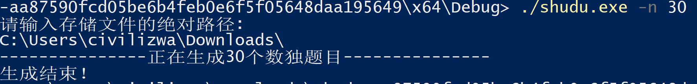

生成的`question.txt`如下所示，以`$`来代替待填的数字：

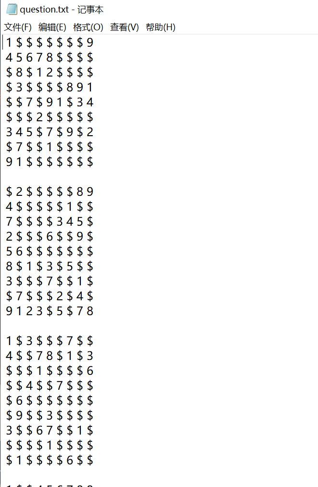

#### 4.4 生成游戏的难度

使用参数`-n`和`-m`，需要指定生成游戏的数量和难度，难度为数字1~3之间，数字越大代表越难

| [para]  | -m                                                           |
| :------ | :----------------------------------------------------------- |
| mean    | 生成游戏的难度                                               |
| range   | 1-3                                                          |
| example | shudu.exe -n 1000 -m 1 【生成1000个简单数独游戏，只有m和n一起使时才认为参数无误，否则请报错】 |

尝试生成难度1：

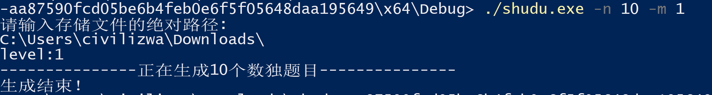

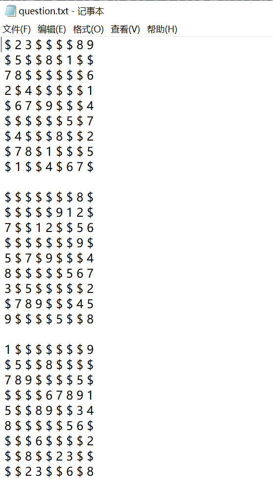

尝试生成难度2：

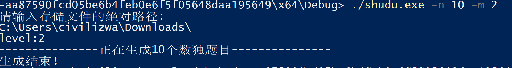

尝试生成难度3：

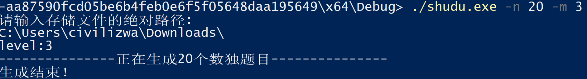


> 求解后的难度3为：
>
> 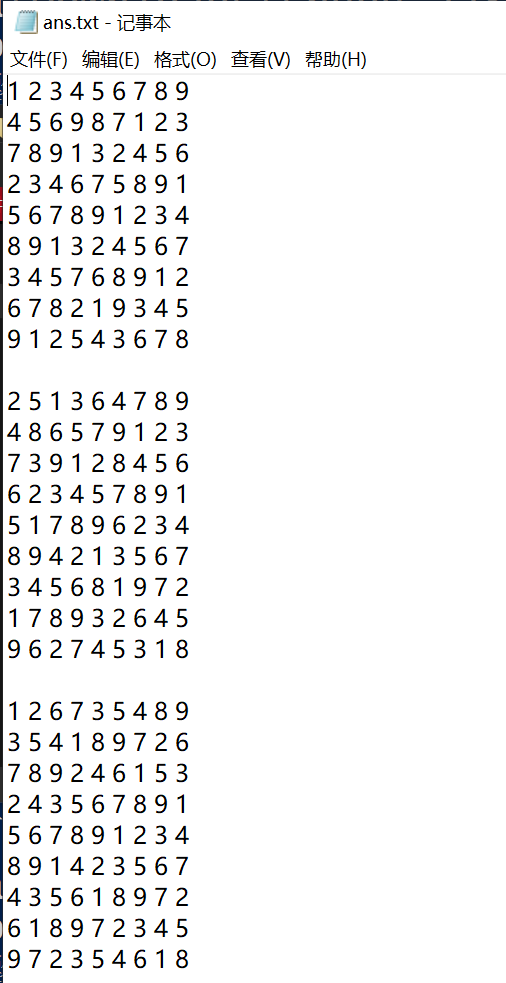

#### 4.5 控制挖空数量范围

同时使用参数`-n`和`-r`，指定生成数独游戏的数量和挖空范围。注意，挖空范围的两个数应用`-`符号链接。

| [para]  | -r                                                           |
| :------ | :----------------------------------------------------------- |
| mean    | 生成游戏中挖空的数量范围                                     |
| range   | 20-55                                                        |
| example | shudu.exe -n 20 -r 20-55 【生成20个挖空数在20~55之间的数独游戏，只有r和n一起使用才认为参数无误，否则请报错】 |

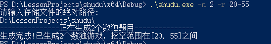

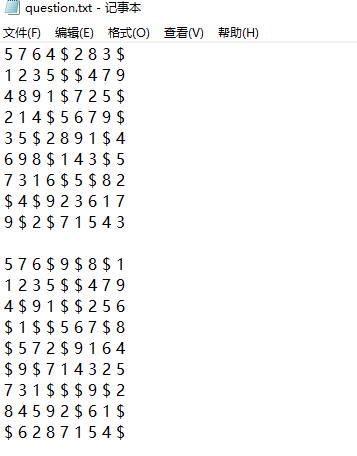

#### 4.6 生成唯一解游戏

同时使用参数`-n`与`-u`，即可指定生成游戏的数量，且它们具有唯一解

| [para]  | -u                                                           |
| :------ | :----------------------------------------------------------- |
| mean    | 生成游戏的解唯一                                             |
| example | shudu.exe -n 20 -u 【生成20个解唯一的数独游戏，只有u和n一起使用才认为参数无误，否则请报错】 |


成功生成了`question.txt`：


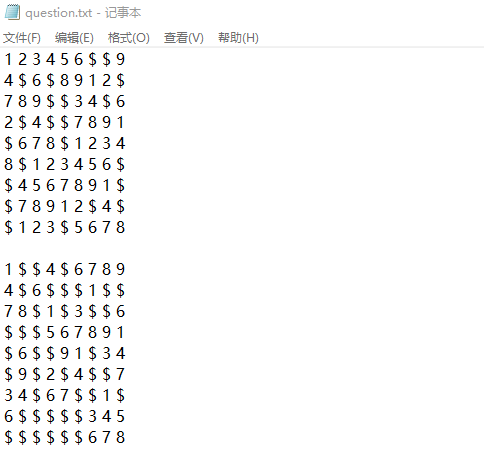

### 5 保存与加载

数独生成与求解的各种文件名解释如下：

- `final.txt`：默认终局文件
- `question.txt`：默认题目存储文件
- `ans.txt`：默认求解结果文件

建议用户使用一个固定目录来存储与管理这些文件，以免发生混乱。

## 质量分析

#### 1 消除警告

我们首先分析警告：

1. 算数溢出

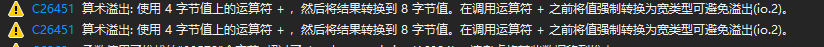

原代码为：

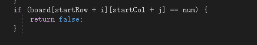

该警告指的是在计算 `startRow + i` 和 `startCol + j` 时，可能会发生整数溢出。这可能是因为编译器把 `startRow + i` 和` startCol + j` 这两个表达式的结果从 `int `（4字节）转换为` size_t` （在64位系统上是8字节）的过程中发生的。然而，由于` startRow`, `startCol`, `i`, 和`j `的值都在 0 到 9 之间，所以这里实际上不可能发生溢出。

但是为了消除，我们应该在做加法运算之前，就先把操作数转换为 `size_t`。这样可以确保加法运算的结果不会超过 `size_t` 可以表示的范围。

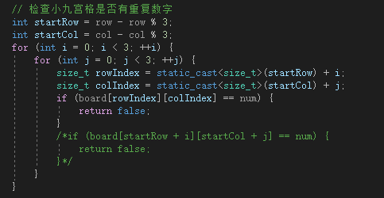

而另一处算数溢出是发生在打印进度条时：


源代码为

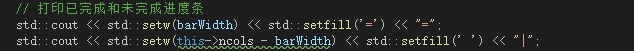

同理，我们使用`static_cast<size_t>`即可消除警告。

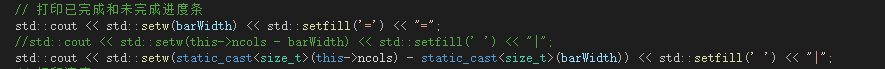

2. `time_T`转换到`unsigned int`，可能丢失数据

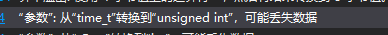

该问题的原代码为：

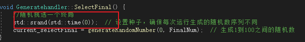

这个警告是由于将 `time_t` 类型的值转换为 `unsigned int` 类型时可能会丢失数据导致的。同样，我们可以使用`static_cast` 进行显式的类型转换。

修改代码为：

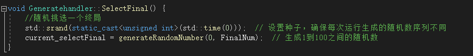

即可消除警告。

3. `_Rep`转换到`int`，可能丢失数据


发生警告的代码为：

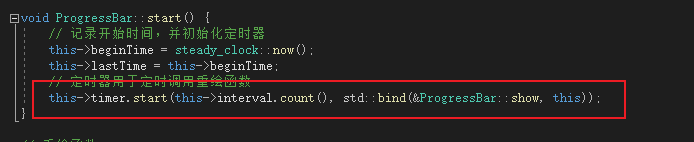

本质上也是数据类型转换的问题，使用`static_cast`解决该问题。修改代码如下：

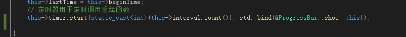

即可消除警告。

另一处同类型的警告的代码为：

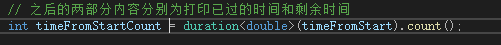

修改为：

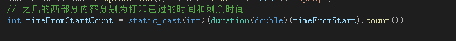

4. `double`转换到`int`，可能丢失数据


发生警告的代码为：

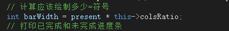

对于将 `double` 转换为 `int`，使用 `static_cast<int>` 来消除警告。

修改代码为：

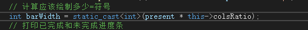

另一处同类型的数据转换问题的警告为：


发生警告的代码为：

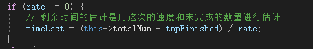

同样使用`static_cast`即可消除警告。

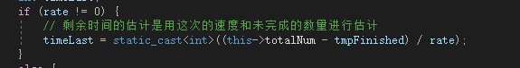

至此，所有警告已全部消除。

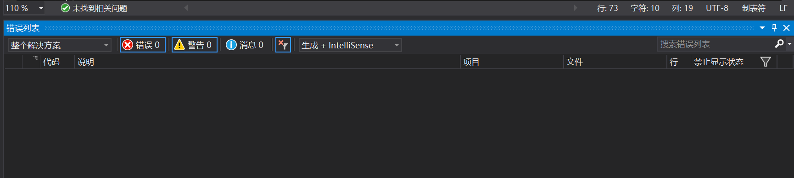

#### 2 静态代码分析

使用VS2019中的Code Analysis进行分析，分析结果如下所示：

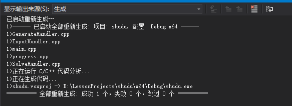

成功运行，没有警告。

### 3 代码规范检查

这里遵循的是谷歌的C++编程规范，链接为：https://zh-google-styleguide.readthedocs.io/en/latest/google-cpp-styleguide/contents/，大致规范为：


图源https://blog.csdn.net/zyy617532750/article/details/81264648

我们使用的代码规范检查工具为cpplint。

1. **GenerateHandler.cpp**

修改前：

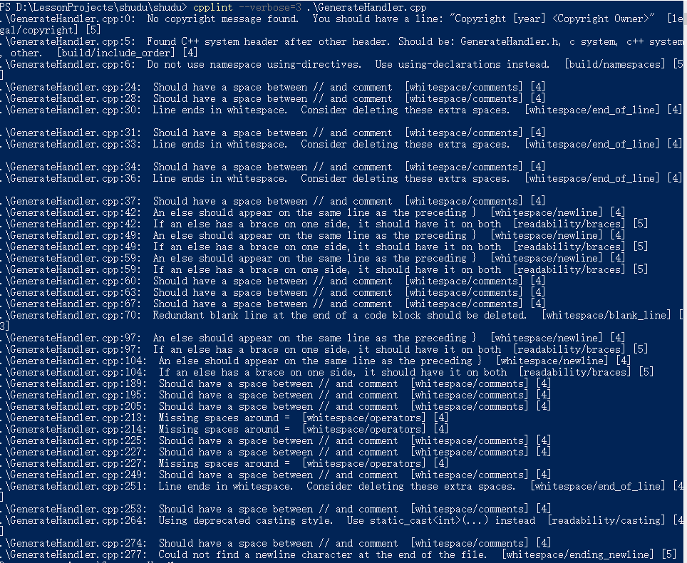

总结错误如下：

1. 没有版权信息：应该在文件中添加版权信息行，例如："Copyright [year] <Copyright Owner>"。[legal/copyright]
2. 头文件包含顺序问题：C++系统头文件应该放在其他头文件之前，正确顺序应为：GenerateHandler.h、C系统头文件、C++系统头文件、其他头文件。[build/include_order]
3. 命名空间错误：不要使用命名空间的using-directives，应使用using-declarations。[build/namespaces]
4. 空格与注释问题：应在注释符 "//" 和注释之间添加空格，删除行末多余的空格，确保代码的一致性和可读性。[whitespace/comments] [whitespace/end_of_line]
5. 大括号和else语句问题：else语句应与前面的 "}" 在同一行上，如果有大括号，应该在两边都使用。这样可以提高代码的可读性。[whitespace/newline] [readability/braces]
6. 多余的空白行问题：应删除代码块末尾多余的空白行。[whitespace/blank_line]
7. 等号周围的空格问题：等号周围应该添加空格，提高代码的可读性。[whitespace/operators]
8. 强制类型转换问题：使用过时的C风格强制类型转换，建议使用`static_cast<int>(...)`进行类型转换。[readability/casting]
9. 文件末尾缺少换行符：文件末尾应包含一个换行符。[whitespace/ending_newline]

根据提示，我们逐行对代码进行修改，修改之后无error，如下图所示：

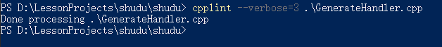

2. **GenerateHandler.h**

对于`GenerateHandler.h`，cpplint提示信息如下：

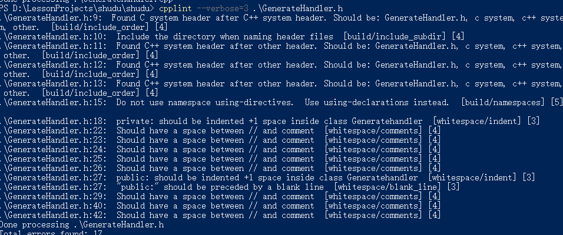

以上errors总结为：

1. 头文件包含顺序问题：C系统头文件应该在C++系统头文件之前。[build/include_order]
2. 头文件命名问题：在命名头文件时，应包含目录信息。[build/include_subdir]
3. 命名空间错误：不要使用命名空间的using-directives，应使用using-declarations。[build/namespaces]
4. 类中的private部分缩进问题：在GenerateHandler类中的private部分应该缩进一个空格。[whitespace/indent]
5. 注释与斜线问题：注释符 "//" 和注释之间应添加一个空格。[whitespace/comments]
6. 类中的public部分缩进问题：在GenerateHandler类中的public部分应该缩进一个空格。[whitespace/indent]
7. 类中的public部分前的空白行问题：在GenerateHandler类中的public部分前应有一个空白行。[whitespace/blank_line]

逐一解决以上问题，最终完全解决所有报错：

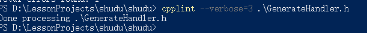

3. **InputHandler.cpp**

TODO

4. **InputHandler.h**

TODO

5. **main.cpp**

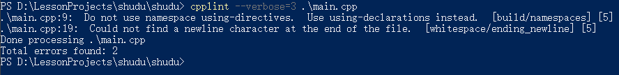

消除以上错误：

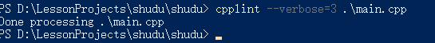

6. **progree.cpp**

TODO

7. **progress.h**

TODO

8. **SolveHandler.cpp**

大部分错误我们之前已经遇到过，逐行修改即可：


## 单元测试


## 性能分析

